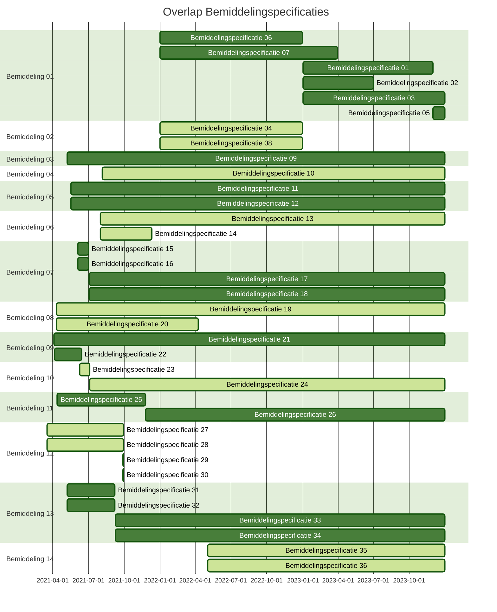

# Beschikbare data
De data in de database ([bemiddelingsregisterDB.db](bemiddelingsregisterDB.db) is gebaseerd op de *casuistiek* van het Estafettemodel iWlz 2.4.3, omgezet naar het netwerkmodel. Hieronder volgt een overzicht en mapping naar de verschillende casuistiek. Er is een extra Casus toegevoegd om `Overdracht` te vullen.

**Bemiddeling:**
| **Casus** 	| **Bemiddeling** 	| **bemiddelingID** 	| **Verantw. Zorgkantoor** 	| **Verantw. Ingangsdatum** 	| **Verantw. Einddatum** 	|
|---	|---	|---	|---	|---	|---	|
| Casus 0 	| Bemiddeling 01 	| dbc7af23-28b8-4843-a53f-fa460bc994be 	| 5151 	| 2023-01-01 	|  	|
| Casus 0 	| Bemiddeling 02 	| 0706473f-51be-4362-a4af-3f9eadc6d561 	| 5353 	| 2022-01-01 	| 2022-12-31 	|
| Casus 1a 	| Bemiddeling 03 	| 3c6ad937-6d67-4e3e-b443-28d68ee9c1e0 	| 5454 	| 2021-05-07 	|  	|
| Casus 1b 	| Bemiddeling 04 	| 764d4d43-2975-43c3-a31a-e611b16cf717 	| 5454 	| 2021-08-06 	|  	|
| Casus 2 	| Bemiddeling 05 	| bf960bba-405c-4226-935e-303b4776e972 	| 5151 	| 2021-05-18 	|  	|
| Casus 3a - 3b 	| Bemiddeling 06 	| e3a8679e-507b-4f69-9791-c51c9e407423 	| 5151 	| 2021-08-01 	|  	|
| Casus 4a - 4b 	| Bemiddeling 07 	| 98034608-5182-404b-9f6a-c84f86d9e44c 	| 5252 	| 2021-06-04 	|  	|
| Casus 5a 	| Bemiddeling 08 	| dd584c70-c330-4024-b676-536f8b6472a5 	| 5353 	| 2021-04-10 	|  	|
| Casus 6a - 6b 	| Bemiddeling 09 	| da840958-9198-4459-bf39-2a6f8c4bb115 	| 5454 	| 2021-04-03 	|  	|
| Casus 7 	| Bemiddeling 10 	| 9c596b4c-8496-4e86-91b2-bee8d77b6365 	| 5454 	| 2021-06-09 	|  	|
| Casus 9 	| Bemiddeling 11 	| 1e30ec02-1330-4fcf-a293-6eb58a45a6d8 	| 5353 	| 2021-04-11 	|  	|
| Casus 10 	| Bemiddeling 12 	| eac5072a-2442-4899-9fc8-90200f36ec0e 	| 5151 	| 2021-03-17 	|  	|
| Casus 15a + 15b 	| Bemiddeling 13 	| a4e7c69f-7e87-4563-af0e-645ee768ba46 	| 5454 	| 2021-05-07 	|  	|
| Casus 14 	| Bemiddeling 14 	| d28713a2-953e-4fb2-9fb9-8b8a746b5641 	| 5454 	| 2022-05-03 	|  	|

**Bemiddelingspecificatie (Bspec):**
| **Bem** 	| **Bspec** 	| **bemiddelingspecificatieID** 	| **toewijzing- Ingangsdatum** 	| **instelling** 	| **uitvoerend Zorgkantoor** 	| **vaststellingMoment** 	| **toewijzing- Einddatum** 	|
|---	|---	|---	|---	|---	|---	|---	|---	|
| **Bem 01** 	| Bspec 01 	| 4ab74681-aaed-4bd0-aa90-89ba8fbeb1b4 	| 2023-01-01 	| 51510101 	| 5151 	| 2023-01-01T00:00:00.000+01:00 	| 2023-11-30 	|
|  	| Bspec 02 	| 0b101ad6-f5fd-40c3-918f-a65e7d03456d 	| 2023-01-01 	| 51510202 	| 5151 	| 2023-01-01T00:00:00.000+01:00 	| 2023-06-30 	|
|  	| Bspec 03 	| 07ba029c-7af0-4b6e-99c2-88a3a16600e8 	| 2023-01-01 	| 52520303 	| 5252 	| 2023-12-01T00:00:00.000+01:00 	|  	|
|  	| Bspec 05 	| 51caca19-0fd0-4fe1-802b-88f1b44e5f35 	| 2023-12-01 	| 51510505 	| 5151 	| 2023-12-01T00:00:00.000+01:00 	|  	|
|  	| Bspec 06 	| 4c46c5dc-489e-40e1-9d8f-ba2881112e8f 	| 2022-01-01 	| 51510101 	| 5151 	| 2022-01-01T00:00:00.000+01:00 	| 2022-12-31 	|
|  	| Bspec 07 	| ebcd3ffd-47d5-4a4b-97d5-11e711972cb9 	| 2022-01-01 	| 51510505 	| 5151 	| 2022-01-01T00:00:00.000+01:00 	| 2023-03-31 	|
| **Bem 02** 	| Bspec 04 	| 34c1b810-064e-446d-8d9e-60a739c9e7e4 	| 2022-01-01 	| 53530404 	| 5353 	| 2022-01-01T00:00:00.000+01:00 	| 2022-12-31 	|
| 	| Bspec 08 	| f17ff1f4-a1ba-4862-8acf-884f2ccc46d4 	| 2022-01-01 	| 53530606 	| 5353 	| 2022-05-10T00:00:00.000+01:00 	| 2022-12-31 	|
| **Bem 03** 	| Bspec 09 	| 16304ef3-8dde-49d8-88b0-280bf599763a 	| 2021-05-07 	| 54540707 	| 5454 	| 2021-09-09T00:00:00.000+01:00 	|  	|
| **Bem 04** 	| Bspec 10 	| c5e242b3-e915-463a-8a78-0d6ffc6d5045 	| 2021-08-06 	| 54540707 	| 5454 	| 2021-09-09T00:00:00.000+01:00 	|  	|
| **Bem 05** 	| Bspec 11 	| 772f33d2-d19b-4d40-aaad-fffbceab224b 	| 2021-05-17 	| 55550808 	| 5555 	| 2021-05-18T00:00:00.000+01:00 	|  	|
|  	| Bspec 12 	| ff304eb8-c918-4e01-8830-657882455f8b 	| 2021-05-17 	| 55550909 	| 5555 	| 2021-06-26T00:00:00.000+01:00 	|  	|
| **Bem 06**	| Bspec 13 	| a98de23b-1557-411a-b9de-d5dd57aec3d2 	| 2021-08-01 	| 56561010 	| 5656 	| 2021-12-12T00:00:00.000+01:00 	|  	|
| 	| Bspec 14 	| c0399875-266d-491c-a970-14fcef663d4b 	| 2021-08-01 	| 56561010 	| 5656 	| 2021-08-06T00:00:00.000+01:00 	| 2021-12-10 	|
| **Bem 07** 	| Bspec 15 	| e2b8fccb-42db-423b-8bbe-2429a738e368 	| 2021-06-04 	| 57571111 	| 5757 	| 2021-06-26T00:00:00.000+01:00 	| 2021-07-01 	|
|	| Bspec 16 	| 1d7c33af-c5df-4704-b191-2098bf6d6c36 	| 2021-06-04 	| 57571212 	| 5757 	| 2021-06-09T00:00:00.000+01:00 	| 2021-07-01 	|
| 	| Bspec 17 	| 825a1c1a-95c2-421e-b071-4fcf24ea2a16 	| 2021-07-02 	| 57571111 	| 5757 	| 2021-06-26T00:00:00.000+01:00 	|  	|
|  	| Bspec 18 	| 8cb9f3a2-9011-4999-9148-6b75c244536c 	| 2021-07-02 	| 57571212 	| 5757 	| 2021-07-05T00:00:00.000+01:00 	|  	|
| **Bem 08** 	| Bspec 19 	| 82844236-89e4-421b-9cc2-5b2477eed417 	| 2021-04-10 	| 58581313 	| 5858 	| 2021-04-12T00:00:00.000+01:00 	|  	|
|  	| Bspec 20 	| 5e668b09-c04c-4302-b279-24eb404e0b22 	| 2021-04-10 	| 58581313 	| 5858 	| 2021-04-11T00:00:00.000+01:00 	| 2022-04-09 	|
| B**em 09** 	| Bspec 21 	| e783c31d-e133-467f-a27f-996fb9ec8cf7 	| 2021-04-03 	| 54540707 	| 5454 	| 2021-06-13T00:00:00.000+01:00 	|  	|
| Bem  	| Bspec 22 	| 17d780f9-3238-4044-8db9-0c8aedf7b791 	| 2021-04-05 	| 55550808 	| 5555 	| 2021-04-10T00:00:00.000+01:00 	| 2021-06-14 	|
| **Bem 10** 	| Bspec 23 	| 22f3169f-ecad-42de-b872-f8754993850f 	| 2021-06-09 	| 59591414 	| 5959 	| 2021-06-26T00:00:00.000+01:00 	| 2021-07-05 	|
|   	| Bspec 24 	| dab884e0-17c0-4445-8f45-180681522fe1 	| 2021-07-05 	| 59591414 	| 5959 	| 2021-08-01T00:00:00.000+01:00 	|  	|
| **Bem 11** 	| Bspec 25 	| f1c5c2ef-b14d-4dad-bfca-5541ac7fa50b 	| 2021-04-11 	| 53530404 	| 5353 	| 2021-05-07T00:00:00.000+01:00 	| 2021-11-25 	|
|   	| Bspec 26 	| 6d6ac678-197e-474d-bf79-a859f7368394 	| 2021-11-25 	| 53530404 	| 5353 	| 2022-01-01T00:00:00.000+01:00 	|  	|
| **Bem 12** 	| Bspec 27 	| 9963127a-5f5c-46ba-8085-3b410d5efcc6 	| 2021-03-17 	| 51510505 	| 5151 	| 2021-09-27T00:00:00.000+01:00 	| 2021-09-29 	|
|   	| Bspec 28 	| ebff0308-92d2-4bbc-b5d7-ba22ec0c50da 	| 2021-03-17 	| 53530606 	| 5353 	| 2021-04-03T00:00:00.000+01:00 	| 2021-09-29 	|
|   	| Bspec 29 	| 2953ab30-1628-4896-9803-d4a12d35a015 	| 2021-09-28 	| 51510505 	| 5151 	| 2021-09-27T00:00:00.000+01:00 	| 2021-09-29 	|
|   	| Bspec 30 	| 79378148-6278-4c7f-982e-bcaf8868f627 	| 2021-09-28 	| 53530606 	| 5353 	| 2021-11-25T00:00:00.000+01:00 	| 2021-09-29 	|
| **Bem 13** 	| Bspec 31 	| 8bcba75f-c44e-4f7d-ae8f-f0912757c6b2 	| 2021-05-07 	| 54540707 	| 5454 	| 2021-09-07T00:00:00.000+01:00 	| 2021-09-07 	|
|   	| Bspec 32 	| c73a4154-6a05-499f-a91c-c4ca23eed2bd 	| 2021-05-08 	| 57571212 	| 5757 	| 2021-05-18T00:00:00.000+01:00 	| 2021-09-07 	|
|   	| Bspec 33 	| 803ee2d1-f607-4f4f-a2cf-4ae85e11ef99 	| 2021-09-08 	| 54540707 	| 5454 	| 2021-09-09T00:00:00.000+01:00 	|  	|
|   	| Bspec 34 	| 81f99d48-518b-481e-84f2-90cea44934cb 	| 2021-09-08 	| 57571212 	| 5757 	| 2021-09-27T00:00:00.000+01:00 	|  	|
| **Bem 14** 	| Bspec 35 	| 72504b5e-085c-44a1-b6e2-859736064f3e 	| 2022-05-03 	| 54540707 	| 5454 	| 2022-05-10T00:00:00.000+01:00 	|  	|
|   	| Bspec 36 	| db67a34b-2fe4-411e-a36b-257dbac0631b 	| 2022-05-03 	|  	| 5454 	| 2023-07-01T00:00:00.000+01:00 	|  	|

**Overlap Bemiddelingspecificaties**

**Casus bijzonderheden**
| Casus | Bijzonderheid |
| :-- | :-- |
| Casus 0 | Overdracht |
| Casus 14 | Pgb |