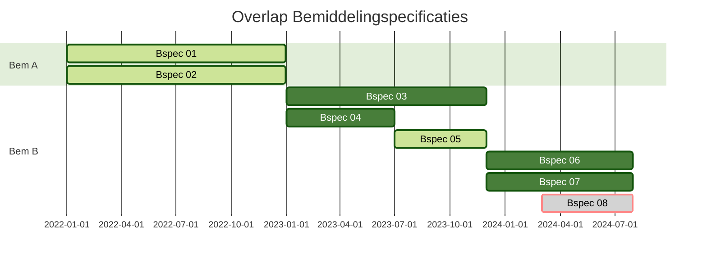

**Bemiddeling:**
| Casus   | Bemiddeling   | bemiddelingID                        | Verantw. Zorgkantoor | Verantw. Ingangsdatum | Verantw. Einddatum |
| ------- | ------------- | ------------------------------------ | ----------------------- | ------------------------ | --------------------- |
| Casus 0 | Bemiddeling A | 0706473f-51be-4362-a4af-3f9eadc6d561 | 5353                    | 2022-01-01               | 2022-12-31            |
| Casus 0 | Bemiddeling B | dbc7af23-28b8-4843-a53f-fa460bc994be | 5151                    | 2023-01-01               |                       |

**Bemiddelingspecificatie (Bspec):**
| Bem   | Bspec    | bemiddelingspecificatieID            | toewijzing- Ingangsdatum | instelling | uitvoerend Zorgkantoor | vaststellingMoment              | toewijzing- Einddatum |
| ----- | -------- | ------------------------------------ | --------------------------- | ---------- | ------------------------- | ------------------------------- | ------------------------ |
| Bem A | Bspec 01 | 34c1b810-064e-446d-8d9e-60a739c9e7e4 | 2022-01-01                  | 53530404   | 5353                      | 2022-01-01T00:00:00.000+01:00   | 2022-12-31               |
|       | Bspec 02 | f17ff1f4-a1ba-4862-8acf-884f2ccc46d4 | 2022-01-01                  | 53530606   | 5353                      | 2022-05-10T00:00:00.000+01:00   | 2022-12-31               |
| Bem B | Bspec 03 | 4ab74681-aaed-4bd0-aa90-89ba8fbeb1b4 | 2023-01-01                  | 51510101   | 5151                      | 2023-01-01T00:00:00.000+01:00   | 2023-11-30               |
|       | Bspec 04 | 0b101ad6-f5fd-40c3-918f-a65e7d03456d | 2023-01-01                  | 51510202   | 5151                      | 2023-01-01T00:00:00.000+01:00   | 2023-06-30               |
|       | Bspec 05 | 07ba029c-7af0-4b6e-99c2-88a3a16600e8 | 2023-07-01                  | 52520303   | **5252**                      | 2023-07-01T00:00:00.000+01:00   | 2023-11-30               |
|       | Bspec 06 | 51caca19-0fd0-4fe1-802b-88f1b44e5f35 | 2023-12-01                  | 51510505   | 5151                      | 2023-12-01T00:00:00.000+01:00   |                          |
|       | Bspec 07 | 4c46c5dc-489e-40e1-9d8f-ba2881112e8f | 2023-12-01                  | 51510101   | 5151                      | 2023-12-01T00:00:00.000+01:00   |                          |
|       | Bspec 08 | ebcd3ffd-47d5-4a4b-97d5-11e711972cb9 | *2024-03-01*                | 52520303   | **5252**                      | *2023-12-01T00:00:00.000+01:00* |                          |

